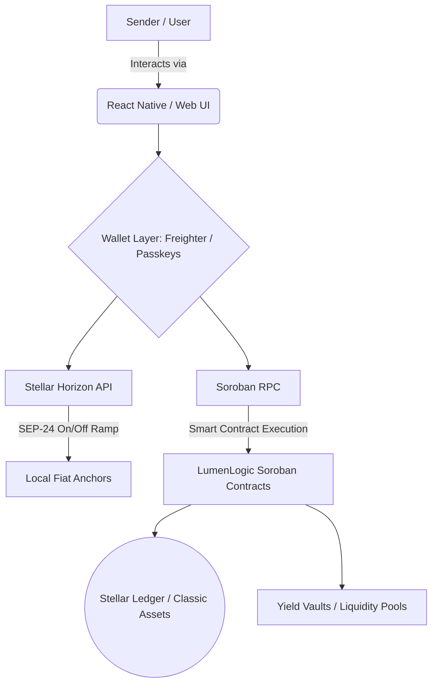
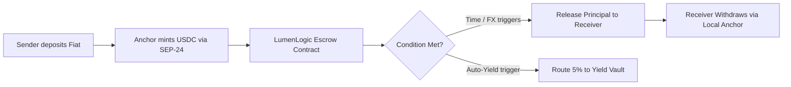
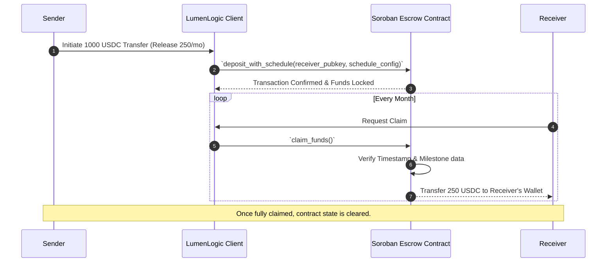

# LumenLogic 🌟

> **The Programmable Remittance & Yield Wallet** > Moving beyond simple transfers: Conditional remittances, milestone-based disbursements, and automated savings powered by Stellar's Soroban smart contracts.


## 📖 Table of Contents
- [About the Project](#about-the-project)
- [Key Features](#key-features)
- [Technical Architecture](#technical-architecture)
- [Flow Diagrams](#flow-diagrams)
- [Sequence Diagrams](#sequence-diagrams)
- [Getting Started](#getting-started)
- [Roadmap](#roadmap)
- [Contributing](#contributing)

---

## 🌍 About the Project
Current remittance tools move value efficiently from Point A to Point B, but lack **financial logic**. Senders cannot enforce how or when funds are released, receivers miss out on yield-bearing on-chain assets, and FX volatility constantly threatens the value of the transfer.

**LumenLogic** is a non-custodial smart wallet built on Soroban that introduces "Programmable Remittances." Instead of just sending USDC, users interact with a Soroban smart contract to set specific logic and parameters on their transfers.

---

## ✨ Key Features
1. **Milestone/Time-Locked Sending:** Deposit USDC into a smart contract that automatically releases predefined amounts to the receiver over time (e.g., paying school fees in monthly installments).
2. **FX-Conditional Releases:** Lock funds that only execute or convert when the local currency exchange rate hits a favorable target (powered by decentralized Oracles).
3. **Auto-Yield Diversion:** Automatically route a configurable percentage (e.g., 5%) of every incoming remittance into a low-risk, yield-bearing Soroban liquidity pool or tokenized Treasury vault.

---

## 🛠 Technical Architecture

LumenLogic leverages the speed and low cost of the Stellar network while utilizing Soroban for programmable logic.

* **Smart Contracts (Backend):** Rust-based Soroban contracts handle escrow, time-locks, and yield-routing logic.
* **On/Off Ramps:** Deep integration with **SEP-24** (Hosted Deposit and Withdrawal) to connect users with local fiat Anchors.
* **Token Standards:** **SEP-41** (Soroban Token Standard) for all stablecoin and yield token interactions.
* **Client Interface:** React Native (Mobile) and Next.js (Web) connecting via the Stellar Horizon API and Soroban RPC.
* **Wallets:** Freighter integration and native Passkeys for seamless onboarding.

---

## 📊 Flow Diagrams

### High-Level Architecture Flow



### Remittance Routing Flow



---

## 🔄 Sequence Diagrams

### Time-Locked Remittance Execution



---

## 🚀 Getting Started

### Prerequisites
* [Node.js](https://nodejs.org/) (v18+)
* [Rust](https://www.rust-lang.org/tools/install) (latest stable)
* [Stellar CLI](https://developers.stellar.org/docs/build/smart-contracts/getting-started/setup) (`stellar-cli`)
* pnpm (v8+)

### Installation & Local Setup

1. **Clone the repository:**
   ```bash
   git clone https://github.com/your-org/LumenLogic.git
   cd LumenLogic
   ```

2. **Setup Soroban Contracts:**
   ```bash
   cd contracts
   make build
   make test
   ```

3. **Run the Frontend UI:**
   ```bash
   cd ../frontend
   pnpm install
   pnpm dev
   ```

---

## 🗺 Roadmap
- [x] Core Architecture Design & Wireframing
- [ ] Soroban Escrow & Time-lock Contract implementation
- [ ] Testnet deployment & internal audits
- [ ] Anchor (SEP-24) integration for Cash-in/Cash-out
- [ ] Auto-Yield Soroban Router implementation
- [ ] Mainnet Beta Launch

---

## 🤝 Contributing
We welcome contributions from the Stellar and open-source community! 
Please read our [CONTRIBUTING.md](CONTRIBUTING.md) to understand how to get started, our code of conduct, and our pull request process.

## 📄 License
Distributed under the MIT License. See `LICENSE` for more information.
